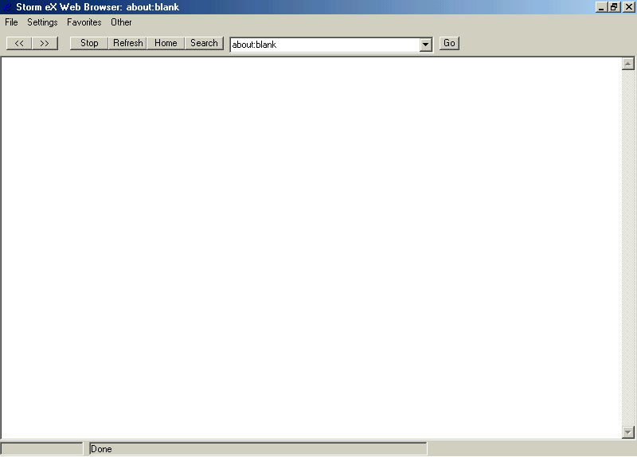



## A\-Storm eX Web Browser\-A

### Description

This is a small web browser that uses Internet Explorer's Web Control. This browser also some cool features on it. It will store your favorite web sites in a list box, it has and options screen that allow you to customize it for the start-up page, and search page. It also features a text pad where you can jot down notes which are saved into the system registry. You can also save a page, print, print preview, print setup, and has a page properties command. There is also a working status bar and a cool progress bar.

This shows pretty much the basics of using the Internet Explorer control. Please leave comments and vote for my code if you like it.

(please note: There are a few minor bugs I have yet to work out. Nothing that will cause an error of any sort. If you do find an error in the code please contact me and I will try to fix it.)
 
### More Info
 
Users should use the most recent version of Internet Explorer (5.0). Sorry, I am working on creating my own web browser control so people without IE can still use it.

             |
---                |---
**Submitted On**   |2001-04-29 12:40:52
**By**             |[Stormgard](https://github.com/Planet-Source-Code/PSCIndex/blob/master/ByAuthor/stormgard.md)
**Level**          |Intermediate
**User Rating**    |4.5 (18 globes from 4 users)
**Compatibility**  |VB 6\.0
**Category**       |[Coding Standards](https://github.com/Planet-Source-Code/PSCIndex/blob/master/ByCategory/coding-standards__1-43.md)
**World**          |[Visual Basic](https://github.com/Planet-Source-Code/PSCIndex/blob/master/ByWorld/visual-basic.md)
**Archive File**   |[Storm eX W19086512001\.zip](https://github.com/Planet-Source-Code/stormgard-a-storm-ex-web-browser-a__1-22852/archive/master.zip)

